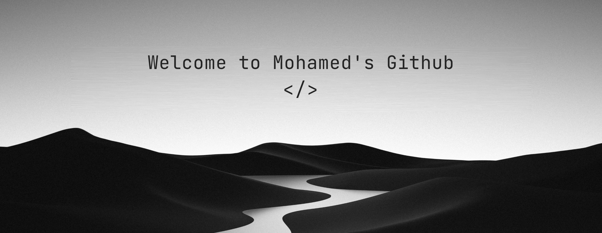

  

 

## Mohamed Guernaoui

Fullstack developer based in Morocco. I build web applications end to
end, from backend architecture through to frontend polish.

Right now I'm going deeper on software architecture with Java —
microservices and cloud — and wiring LLM APIs into production systems
over REST and GraphQL. Away from the keyboard, chess.

---

### Writing

- [Splitting a monolith without stopping shipping](#) — what I'd do
  differently on the second attempt.
- [Putting an LLM behind a GraphQL schema](#) — cost, caching and the
  failure modes nobody warns you about.
- [Reading chess games like code review](#) — a short one.

---

 
  [LinkedIn](#) · [Blog](#) · [Email](#)

<h2 align="center"><em>Technologies</em></h2>

  
  
  
  
  
  
  
  
  
  

 

<!-- <h2 align="center"><em>Statistics</em></h2> -->

<!-- 
 
  
 
 -->
